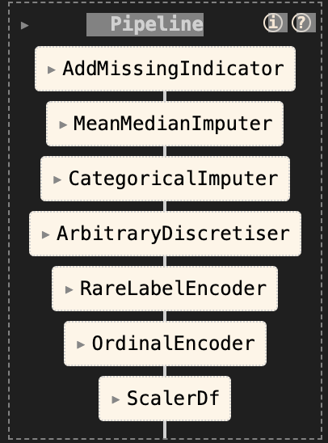

# loan_defaults
Code repo to predict default in loans
---
# Modelo para Detección de default

## Introducción
La importancia de predecir si un crédito entrará en default es fundamental para cualquier entidad financiera o institución crediticia. La capacidad de anticiparse a estos eventos no solo implica una gestión eficiente de los riesgos, sino que también puede conducir a decisiones informadas sobre la concesión de créditos, la asignación de recursos y la formulación de políticas de riesgo

En la carpeta [notebooks](notebooks/), encontrarás un análisis exploratorio de datos donde se exploran todas las posibles transformaciones necesarias para los datos. Puedes consultar este análisis en el archivo [eda.ipynb](notebooks/01-eda.ipynb).

### Feature engineering
Se realizaron diversas transformaciones de los datos, las cuales se detallan en el archivo [feature_engineering.ipynb](notebooks/02-feature_engineering.ipynb). Estas transformaciones dieron lugar a un pipeline que se muestra a continuación:

En este proceso, se aplicaron diversas transformaciones, codificaciones, imputaciones y escalado de datos, todos los cuales se detallan en el cuaderno de trabajo.

Además, se extrajeron características interesantes de la fecha, como el día de la semana y la hora del día, que podrían ser relevantes para la detección de fraudes.

### Feature Selection
Para mejorar el pipeline anterior, se propone un método de selección de características en el cual se introducen variables completamente aleatorias y se mantienen aquellas características que tienen una importancia mayor que estas variables aleatorias. Las características seleccionadas son `['loan_amnt', 'funded_amnt', 'funded_amnt_inv', 'term', 'int_rate', 'installment', 'annual_inc', 'addr_state', 'dti', 'revol_bal', 'revol_util', 'total_acc', 'total_pymnt', 'total_pymnt_inv', 'total_rec_prncp', 'total_rec_int', 'last_pymnt_amnt']`.

 ### Model Training

En el archivo [model_training.ipynb](notebooks/04-model%20_training.ipynb), se lleva a cabo el entrenamiento de varios modelos, y al final se selecciona XGBoost como el modelo que arroja los mejores resultados.

## Trabajo Futuro
- Agregar versionamiento de datos con DVC como lo hago en [ESTE PROYECTO](https://github.com/Wilmar3752/cluster-app)
- Realizar el API con FastApi (por tiempo no la hice)
- Usar Docker
- Usar CI CD con jenkins o github actions para desplegar automaticamente en una nube como AWS, Azure o GCP
- Crar una base de datos que guarde los request y los response del API